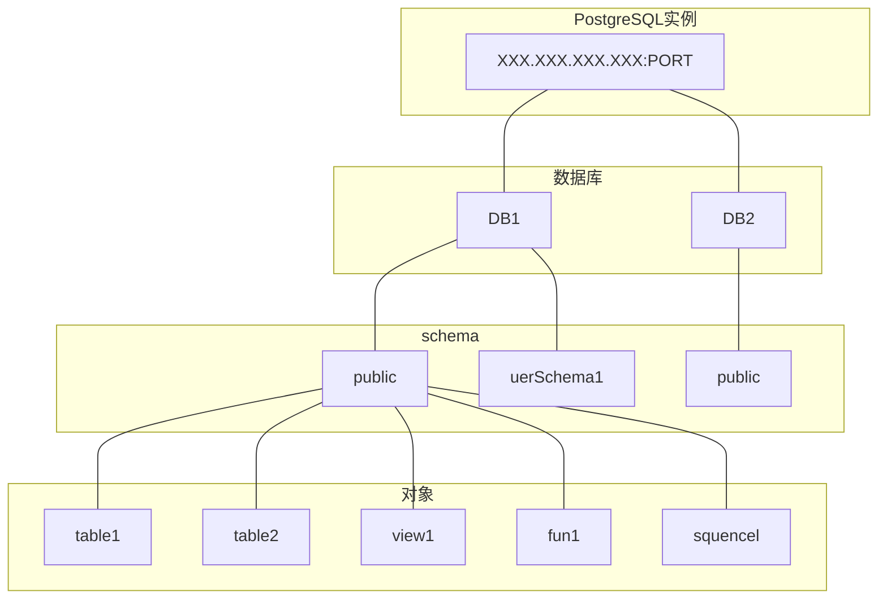

## PostgreSQL整体结构理解

### 一、逻辑结构



### 二、表空间

#### 1. 概念

在`postgres`中，表空间允许在文件系统中定义数据库对象存储的位置，也就是指定了一个目录。一个表空间可以让多个数据库使用，一个数据库也可以使用多个表空间，属于”多对多“的关系。

#### 2. 主要应用场景

- 存储磁盘没有空间时，可以使用表空间把数据存储到其他的地方；
- 优化性能，如频繁使用的数据表或者索引放在高性能的硬盘上，而较少使用的放在普通硬盘上。

#### 3. 初始表空间

`postgres `自带了两个表空间：

- `pg_default`：用来存储系统目录对象、用户表、用户表index、和临时表、临时表index、内部临时表的默认空间；

- `pg_global`： 用来存放系统字典表。

#### 4. 相关语句

查询已经存在的表空间：

```sql
SELECT * FROM PG_TABLESPACE;
```

创建表空间，所有者`postgres`，表空间名称`tsp01`，存放目录`F:\test\`要保证文件夹存在且为空：

```sql
CREATE TABLESPACE tsp01 OWNER postgres LOCATION 'F:\test\';
```

给数据库普通用户授予表空间上权限：

```sql 
GRANT CREATE ON TABLESPACE tsp01 TO user;
-- 在表空间上创建表
CREATE TABLE test(id int) TABLESPACE tsp01;
```

给数据库指定表空间：

```sql
ALTER DATABASE database_name SET TABLESPACE new_tablespace_name;
```

移动表所属表空间：

```sql
ALTER TABLE table_name SET TABLESPACE new_tablespace_name;
```

删除表空间：

```sql
DROP TABLESPACE IF EXISTS tablespace_name;
```

### 三、模式（Schema）

#### 1. 概念

一个数据库包含一个或多个已命名的模式，模式又包含表。模式还可以包含其它对象， 包括数据*类型*、*函数*、*操作符* 等。同一个对象名可以在不同的模式里使用而不会导致冲突； 和数据库不同，模式不是严格分离的：只要有权限，一个用户可以访问他所连接的数据库中的任意模式中的对象。但是，模式不可以嵌套。

#### 2. 使用模式的优点：

- 允许多个用户使用一个数据库而不会干扰其它用户。
- 把数据库对象组织成逻辑组，让它们更便于管理。
- 第三方的应用可以放在不同的模式中，这样它们就不会和其它对象的名字冲突。

#### 3. 相关语句

创建模式：

```sql
create schema myschema;
```

删除为空的模式：

```sql
DROP SCHEMA myschema;
```

删除模式以及其包含的所有对象：

```sql
DROP SCHEMA myschema CASCADE;
```

### 四、表空间、数据库、模式、表、用户、角色之间的关系

#### 1. 角色和用户关系

角色和用户在`postgresql`中是完全相同的两个对象，唯一的区别是在创建的时候，用户默认有`LOGIN`的权限而角色没有。

**角色、用户创建语句：**

```sql
CREATE ROLE role_name PASSWORD 'psw';
ALTER ROLE role_name LOGIN; -- 为角色赋权 登录
-- 创建用户
CREATE USER user_name PASSWORD 'psw';
```

#### 2. 数据库与模式关系

模式是对数据库的逻辑分隔，在创建数据库的时候`PostgreSQL`会默认创建一个模式 `Public`，所有为此数据库创建的对象(表、函数、试图、索引、序列等)都是创建在这个模式中的。

创建模式：

```sql
CREATE SCHEMA schema_name;
ALTER SCHEMA schema_name OWNER TO user_name; -- 赋权
```

在模式下创建表：

```sql
CREATE TABLE schema_name.test (uuid integer not null);
```

操作模式下表：

```sql
insert into new_schema.test (uuid) values ('100001');
commit;
select * from new_schema.test;
```

#### 3. 表空间与数据库关系

一个表空间可以让多个数据库使用，一个数据库也可以使用多个表空间，属于”多对多“的关系。详情见第二节表空间。

### 五、总结

表空间是磁盘上的一个文件夹，在这个文件夹中可以存储多个数据库。在数据库中，创建是会先创建一个默认的模式，之后又在模式中创建表等对象并将不同的模式指派给了不同的角色，可以实现权限分离，也可以通过授权实现模式间的对象的共享。